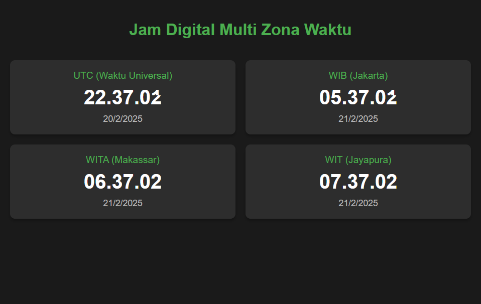

# jam-digital
## Pendahuluan
Saya mencoba membuat jam digital yang menampilkan waktu di berbagai zona waktu. Saya membuatnya dengan menggunakan HTML, CSS, dan JavaScript yang mudah dimengerti dan dapat digunakan.

Berikut adalah penampakan dari implementasi tersebut dengan 4 zona waktu yang berbeda (UTC, WIB/Jakarta, WIT/Jayapura, dan WITA/Makassar):

## Fitur-fitur dari jam digital ini:

1. Menampilkan waktu untuk 4 zona waktu berbeda:
   - UTC (Waktu Universal)
   - WIB (Waktu Indonesia Barat - Jakarta)
   - WITA (Waktu Indonesia Tengah - Makassar)
   - WIT (Waktu Indonesia Timur - Jayapura)

2. Untuk setiap zona waktu ditampilkan:
   - Nama zona waktu
   - Waktu saat ini (jam:menit:detik)
   - Tanggal saat ini

3. Desain responsif yang akan menyesuaikan dengan ukuran layar

4. Pembaruan waktu otomatis setiap detik

5. Tampilan modern dengan:
   - Latar belakang gelap yang nyaman di mata
   - Warna hijau untuk aksen
   - Bayangan untuk memberikan efek kedalaman
   - Font yang mudah dibaca

## Cara menggunakan:
1. Kode implementasi terdapat dalam file dengan nama `index.html`
2. Buka file tersebut di browser web
3. Jam digital akan langsung berjalan dan memperbarui waktu setiap detik

### Jam digital ini menggunakan:
- HTML5 untuk struktur
- CSS3 untuk styling dan layout responsif
- JavaScript modern untuk fungsi waktu
- API Date built-in JavaScript
- Locale string untuk format waktu dan tanggal yang sesuai dengan format Indonesia

Anda dapat dengan mudah menambahkan zona waktu lain atau mengubah tampilan dengan memodifikasi kode HTML, CSS, atau JavaScript sesuai kebutuhan.
